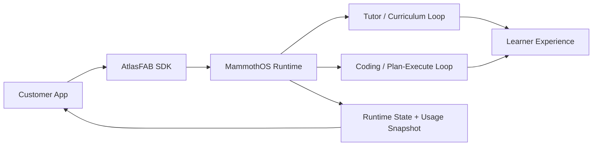

# ATLAS FAB Product Guide

ATLAS FAB is the embeddable tutoring surface of MammothOS: a product for teams that want adaptive teaching loops, page-aware coaching, and runtime-state visibility inside an existing app.

## Positioning

**What it is**
- an embeddable Python SDK for adaptive tutoring and lesson flows
- a bridge between standalone learning UX and MammothOS orchestration
- a safer integration path than pasting generic chat into a product

**Who it is for**
- education startups adding guided learning to an existing app
- internal enablement teams building role-based training tools
- operators who want tutoring, coding help, and workflow visibility in one surface

**Why it is different**
- page-aware context keeps the FAB aligned with the screen the learner is on
- runtime-state reporting exposes provider health and fallback behavior
- structured lesson / submit / next-step flows are programmatic, not prompt-only

## What a buyer gets

### Core package
- `AtlasFAB` SDK entry point
- `AtlasFABConfig` for audience, mode, metadata, and identity
- lesson start, submission review, generation, and runtime snapshot methods
- compatibility with existing `ATLASSession` flows

### Expansion path
- hosted API and tenant auth
- billing / usage warnings
- white-label embed patterns
- team reporting and curriculum controls

## Workflow diagram

## Deployment modes

| Mode | Best for | Notes |
|---|---|---|
| SDK-only | local pilots and internal tooling | Fastest adoption path, local-state preview metering |
| SDK + FastAPI | controlled deployments | Adds backend routes, auth guardrails, and richer observability |
| Hosted tenant product | commercialization | Adds tenant auth, billing, entitlements, and support posture |

## Pricing skeleton

> Pricing is a draft packaging skeleton, not a live checkout promise.

| Plan | Target buyer | Draft price | Included value |
|---|---|---:|---|
| Explorer | solo builders / pilots | Free | core SDK flow, adaptive tutor loop, local-state persistence |
| Pro | product teams | $49-$99 / month per workspace | hosted sync, exports, usage warnings, higher limits |
| Enterprise | schools / multi-team orgs | custom | tenant onboarding, SSO direction, white-label, rollout support |

## Buyer-facing promise

- faster time to an adaptive tutor inside an existing product
- safer routing than generic assistant overlays
- clearer operator visibility into runtime health, usage, and entitlement state

## Current launch caveats

- usage metering is still labeled preview/local-state until hosted billing is wired
- enterprise packaging is directional until tenant auth and billing are fully live
- public docs should not claim checkout or subscriptions are active until payments are enabled
